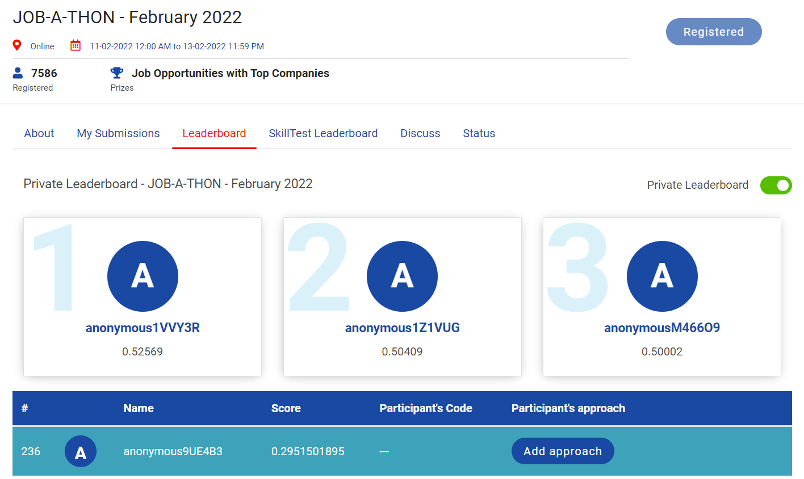

# Analytics-Vidhya-Jobathon-February-2022

The largest Data Science Hiring Event is Back!
And this event is your one shot at scoring your dream job.

Analytics Vidhya presents “JOB-A-THON” - India's Largest Data Science Hiring Event, where 1600+ of candidates have interviewed for over 65+ companies. You could be among them too! 

At JOB-A-THON every enthusiast will get the opportunity to showcase their skills and get a chance to interview with top companies for leading job roles in Data Science, Machine Learning & Analytics. 

**RANK:** 236 out of 7586

**SCORE:** 0.2951501895

## Problem Statement:
ABC is an online content sharing platform that enables users to create, upload and share the content in the form of videos. It includes videos from different genres like entertainment, education, sports, technology and so on. The maximum duration of video is 10 minutes.

Users can like, comment and share the videos on the platform.

Based on the user’s interaction with the videos, engagement score is assigned to the video with respect to each user. Engagement score defines how engaging the content of the video is.

Understanding the engagement score of the video improves the user’s interaction with the platform. It defines the type of content that is appealing to the user and engages the larger audience.

The main objective of the problem is to develop the machine learning approach to predict the engagement score of the video on the user level.

## Acknowledgements:
https://datahack.analyticsvidhya.com/contest/job-a-thon-february-2022/

## Data Dictionary:
| **Variable** | **Description** |
| --- | --- |
| row\_id | Unique identifier of the row |
| user\_id | Unique identifier of the user |
| category\_id | Category of the video |
| video\_id | Unique identifier of the video |
| age | Age of the user |
| gender | Gender of the user (Male and Female) |
| profession | Profession of the user (Student, Working Professional, Other) |
| followers | No. of users following a particular category |
| views | Total views of the videos present in the particular category |
| engagement\_score | Engagement score of the video for a user |

